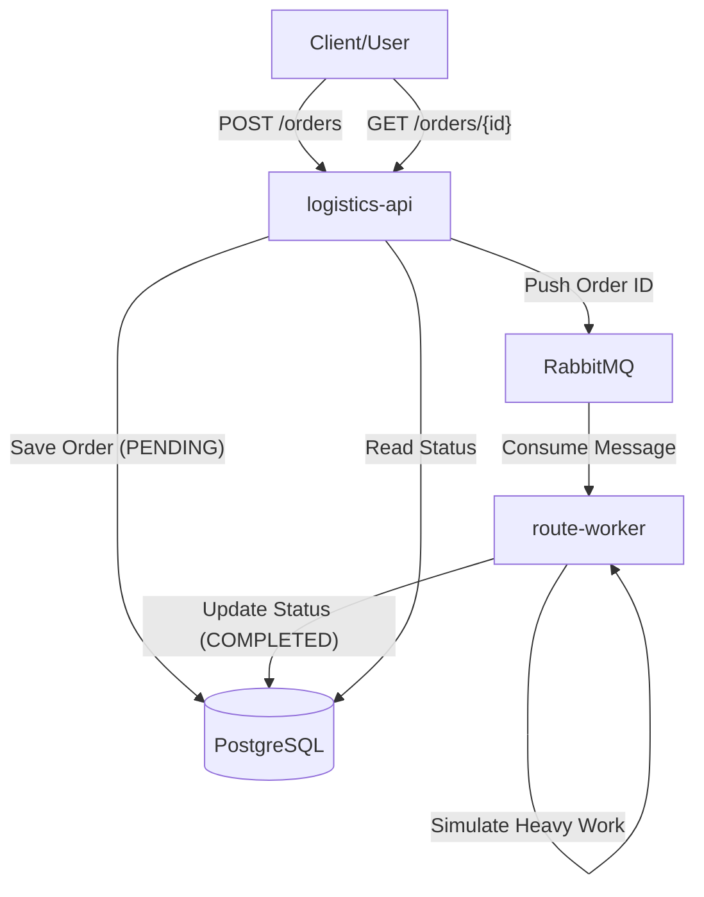
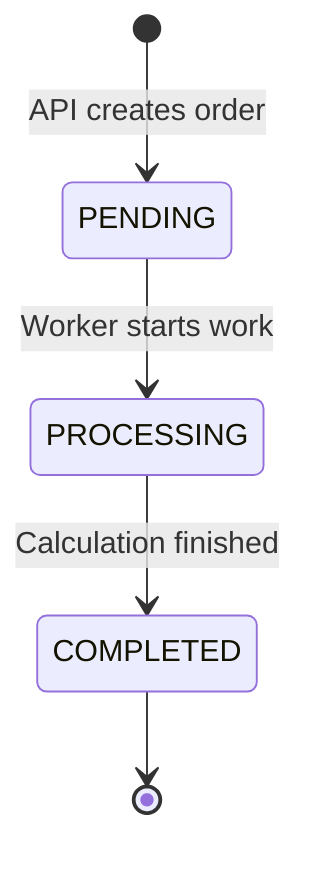

# Enterprise Logistics Hub (EGLH)

A production-like logistics system for processing transport orders, built with Java (Quarkus) and Kubernetes. This project focuses on mastering Kubernetes orchestration, stability, and scaling.

## Core Architecture
- **`logistics-api`**: Entry point for receiving orders.
- **`route-worker`**: Asynchronous worker for CPU-intensive route optimization.
- **PostgreSQL**: Persistent storage for order metadata.
- **RabbitMQ**: Message broker for reliable communication.

### Component Interaction


### Order Lifecycle


## Quick Start (Local Docker Compose)

1. **Build and Start**:
   ```bash
   cd enterprise-logistics-hub
   docker-compose up -d --build
   ```

2. **Test the Flow**:
   ```bash
   # Create an order
   curl -X POST -H "Content-Type: application/json" -d '{"origin": "Warsaw", "destination": "Berlin"}' http://localhost:8080/orders

   # Check status (Wait ~6 seconds for processing)
   curl http://localhost:8080/orders/1
   ```

## Kubernetes (k3s)

We provide automated manifests and a deployment script for local K8s testing.

1. **Deployment**:
   ```bash
   cd enterprise-logistics-hub
   ./deploy-k3s.sh
   ```

2. **Verify**:
   ```bash
   kubectl get pods
   kubectl get hpa
   ```

For detailed Kubernetes documentation, see [k8s/README.md](k8s/README.md).

## Project Structure
- `logistics-api/`: Quarkus REST API.
- `route-worker/`: Quarkus worker processing RabbitMQ messages.
- `k8s/`: Kubernetes manifests (Infrastructure, Config, Apps).
- `docker-compose.yaml`: Local development environment.

## Key Features
- **Persistence**: PostgreSQL and RabbitMQ use StatefulSets with PVC.
- **Scaling**: Horizontal Pod Autoscaler (HPA) for the worker based on CPU usage.
- **Reliability**: Liveness and Readiness probes for all components.
- **Security**: Non-root container execution (UID 185/1001/999).