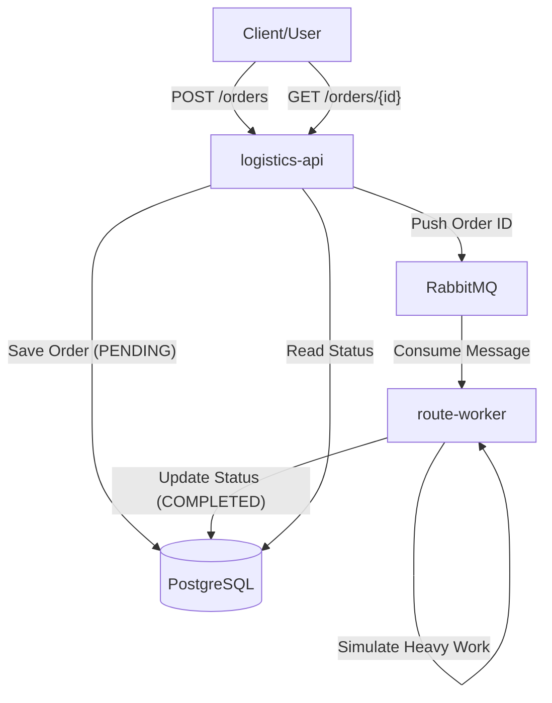

# Enterprise Logistics Hub (EGLH)

A production-like logistics system for processing transport orders, built with Java (Quarkus) and Kubernetes. This project serves as a comprehensive **CKAD (Certified Kubernetes Application Developer)** study case, covering 100% of the exam scope.

## Core Architecture
- **`logistics-api`**: Entry point for receiving orders.
- **`route-worker`**: Asynchronous worker for CPU-intensive route optimization.
- **PostgreSQL**: Persistent storage for order metadata.
- **RabbitMQ**: Message broker for reliable communication.

### Component Interaction


## Quick Start (Kubernetes / k3s)

We provide a fully automated script to build apps, load images, and deploy the entire stack to a local `k3s` cluster.

1. **Deployment**:
   ```bash
   cd enterprise-logistics-hub
   ./deploy-k3s.sh
   ```

2. **Verify**:
   The script creates a dedicated namespace `logistics`.
   ```bash
   kubectl get all -n logistics
   ```

3. **Access API**:
   You can access the API via Ingress (add `127.0.0.1 eglh.local` to `/etc/hosts`) or Port Forward:
   ```bash
   kubectl port-forward -n logistics service/logistics-api 8080:8080
   ```

## CKAD Mastery Features
This project implements advanced Kubernetes concepts required for the CKAD exam and real-world production systems:

- **State & Persistence**: StatefulSets, PersistentVolumeClaims, Headless Services.
- **Security**: NetworkPolicies, ServiceAccounts, SecurityContext (Non-root), Namespace Isolation.
- **Scaling & Reliability**: Horizontal Pod Autoscaler (HPA), Liveness/Readiness Probes, Init Containers.
- **Resource Management**: ResourceQuota, LimitRange.
- **Maintenance**: CronJobs for database cleanup.

For detailed technical documentation and manifest explanation, see [k8s/README.md](k8s/README.md).

## Local Development (Docker Compose)
For quick local testing without Kubernetes:
```bash
docker-compose up -d --build
```
